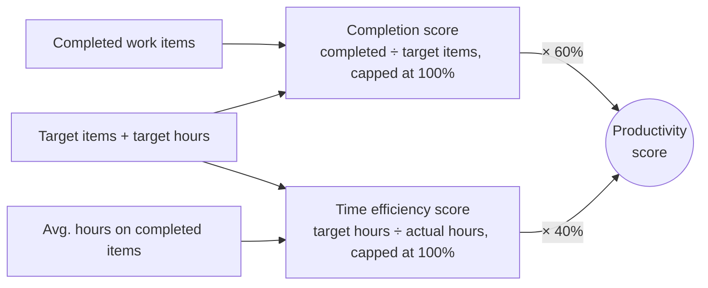
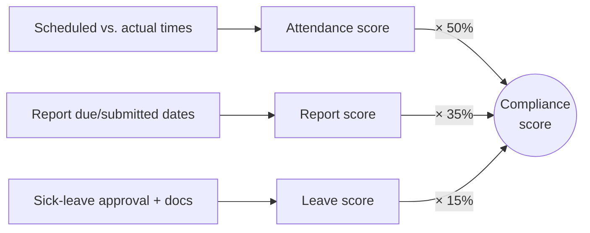
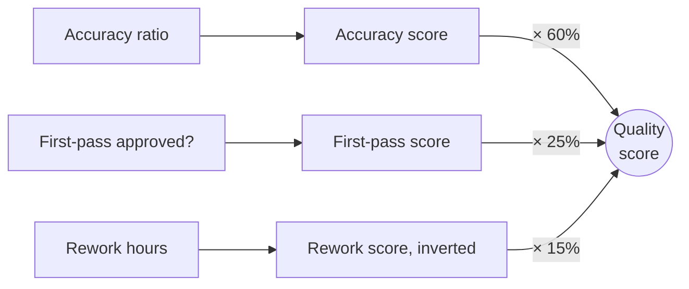

# How performance scoring works, and where it's limited

## Context

This is a plain-language walkthrough of how the three KPIs — productivity,
compliance, and quality — are actually calculated today, followed by the
limitations of each approach. Written ahead of building the adaptive
performance tracker, so we have one place that explains both "how it works
now" and "what would need to change for it to adapt." None of the
limitations below are bugs unless noted — most are deliberate MVP choices
that are hardcoded rather than configurable.

---

## Productivity

### How it's calculated

For each employee, we look at every work item (project) they completed
during the period, plus their personal target — how many items they're
expected to complete and how many hours each one should take on average.
Two things get measured and blended:

- **Completion** — how many work items were actually completed, divided by
  the target number of items for the period. If you request a shorter or
  longer window than the target's default (90 days), the target is scaled
  proportionally. Capped at 100%, so over-delivering doesn't push the score
  past full marks.
- **Time efficiency** — how the average hours spent on completed work
  compares to the target average. Spending fewer hours than the target
  scores higher; also capped at 100%.

These two combine as **60% completion + 40% time efficiency** to produce the
productivity score.

*(`app/services/performance/scoring.py`, `_score_productivity`)*

### Limitations

- **The 90-day window is baked in.** The code assumes every target always
  represents exactly a 90-day baseline and prorates against that fixed
  number. There's no way to express a target with a different natural
  period.
- **Every completed item counts the same.** The source data actually
  includes a `project_weight` per project (some projects are rated as
  bigger/harder than others), but the completion score doesn't use it —
  finishing a small task and a huge one both count as "1 completed item."
  This matches how the reference benchmark was built, so it's intentional
  for now, but it means two people doing very differently sized work get
  compared on a flat count.
- **Missing targets currently over-penalize.** If an employee has no target
  row at all, they either get dropped from the results or the whole
  calculation gets rejected — rather than the more graceful behavior other
  missing evidence gets, which is to just lower confidence in the score
  instead of removing it. (This is being generalized as a separate,
  already-scoped fix.)

---

## Compliance

### How it's calculated

Three independent checks, blended together:

- **Attendance (50%)** — for each work day, compares scheduled vs. actual
  arrival time, shift-end time, and lunch break, and scores how often the
  employee was on time or better.
- **Reports (35%)** — whether required reports were submitted on or before
  their due date and marked verified.
- **Leave (15%)** — whether any sick-leave requests were properly approved
  and fully documented.

If one of these three sources wasn't supplied at all (say, no reports data
came in), that piece is simply left out and the other two are reweighted to
fill the gap — it's treated as "no signal here" rather than counted as a
failure. Approved leave and public holidays never count against attendance;
they're excluded from the "should have been at work" pool entirely.

*If attendance or reports data is missing entirely, that slice is dropped
and the other two are reweighted to fill the gap. Leave works differently —
see the "no sick leave taken defaults to a perfect score" limitation below;
it doesn't get excluded, it defaults to 100 instead.*

*(`app/services/performance/scoring.py`, `_score_compliance`, backed by
`app/services/performance/metrics.py`)*

### Limitations

- **No sick leave taken defaults to a perfect score.** If an employee has
  zero sick-leave requests in the period, leave compliance is scored as a
  full 100 — "nothing to fail against" is treated the same as "fully
  compliant," rather than as unknown. Worth knowing this is a deliberate
  assumption, not a neutral abstention.
- **No grace period on timing.** Arrival and shift-end checks compare
  scheduled vs. actual exactly — arriving one minute late scores the same
  as arriving an hour late. Already flagged as an MVP limitation in
  `docs/data-dictionary.md`.
- **This is the strongest pattern in the codebase, worth reusing.** The
  "missing evidence gets excluded and the rest reweighted, instead of
  forcing a zero or blocking everything" approach here is exactly the
  pattern the productivity-target fix is being generalized from.

---

## Quality

### How it's calculated

Based on quality reviews of completed work:

- **Accuracy (60%)** — how accurate the reviewed work was.
- **First-pass approval (25%)** — whether the work passed review on the
  first try, without needing revisions.
- **Rework (15%)** — how many hours were spent reworking the item; more
  rework hours pulls this piece down (it's inverted, so zero rework hours
  scores full marks).

*(`app/services/performance/scoring.py`, `_score_quality`)*

### Limitations

- **Zero reviews scores a hard 0, not "no data."** Unlike compliance, which
  excludes a missing source and reweights around it, quality treats "no
  reviews at all" as a full failing score rather than skipping the
  component. In practice this doesn't mislead the final result, because
  zero reviews also drives evidence confidence to 0, which gates the
  overall score to "Insufficient data" anyway — but if someone reads the
  raw quality score on its own without also checking the confidence value,
  it can look harsher than it should.

---

## What this means for an adaptive tracker

- **Weights, the 90-day window, and grace periods would need to become
  configuration, not code.** Today they're all hardcoded literals in
  `scoring.py`. An adaptive system implies these can differ per team, role,
  or period — that's a real structural change, not a tweak.
- **Task complexity needs an actual place in the formula.** If
  "productivity" should account for how hard a project was, `project_weight`
  (or something like it) has to be wired into the completion score, not
  just sit unused in the source data.
- **Any formula change needs to be checked against the reference benchmark
  before shipping.** We confirmed this directly in this session — a
  plausible-looking change to how productivity weights completed work was
  tested and reverted after it stopped matching the `Expected_KPI`
  benchmark. A formula can look reasonable and still be wrong relative to
  the agreed-upon ground truth.
